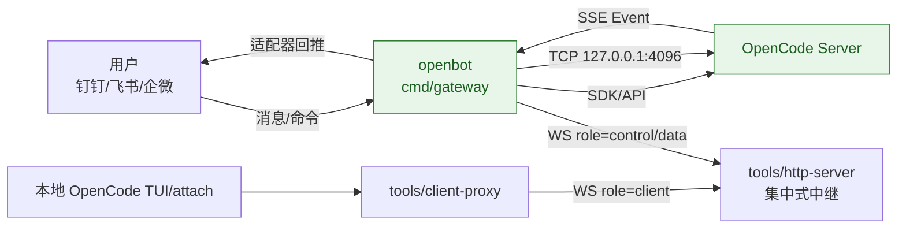

# OpenCode Gateway - 双向通信架构

## 🎯 项目概述

OpenCode Gateway 是一个企业级消息网关，实现了 OpenCode AI 服务器与各种消息平台（飞书、企业微信等）之间的**双向数据交互**。

基于官方 [opencode-sdk-go](https://github.com/anomalyco/opencode-sdk-go) 重构，提供：
- ✅ 消息平台 → OpenCode Server（用户消息转发）
- ✅ OpenCode Server → 消息平台（AI 响应推送）
- ✅ Session 管理和用户映射
- ✅ SSE 事件流监听
- ✅ 可扩展的 Adapter 架构

项目关键差异点（相对常见直连部署）：
- ✅ 默认不开放 openbot HTTP 端口（`HTTP_ENABLED=false`）
- ✅ OpenCode `4096` 无需公网暴露
- ✅ 使用集中式 `tools/http-server` + `tools/client-proxy` 建立代理隧道
- ✅ openbot 只需具备到指定网络的出站访问能力

---

## 🏗️ 架构设计

### 核心组件



### 目录结构

```
opencode-gateway/
├── cmd/
│   ├── gateway/
│   │   └── main.go                # openbot 主入口
│   └── attach/
│       └── main.go                # attach 客户端入口
├── internal/
│   ├── adapters/                  # 钉钉/飞书/企微适配器
│   ├── opencode/
│   │   ├── client.go              # OpenCode SDK 客户端封装
│   │   └── event_listener.go      # SSE 事件监听和分发
│   ├── config/
│   │   └── config.go              # 配置管理
│   ├── proxy/
│   │   └── tunnel.go              # 反向代理隧道
│   ├── scheduler/                 # 任务与 cron 调度
│   └── server/
│       └── server.go              # HTTP 服务器
├── tools/
│   ├── http-server/main.go       # 集中式中继网关
│   └── client-proxy/main.go       # 本地代理桥接
└── docs/PROXY_TUNNEL.md
```

---

## 🚀 核心功能

### 1. 使用官方 SDK 的客户端

**文件：**`internal/opencode/client.go`

```go
// 基于 opencode-sdk-go 的客户端
client := opencode.NewClient(endpoint, apiKey,
    opencode.WithDirectory("."),
    opencode.WithEventHandler(myHandler),
)

// 发送消息到 OpenCode
response, err := client.SendMessage(ctx, opencode.MessagePayload{
    Channel:  "feishu",
    UserID:   "user123",
    ThreadID: "thread456",
    Content:  "你好，AI助手",
})

// 自动管理 Session
// - 为每个 thread 创建或复用 session
// - 通过 SDK 的 Session.Prompt() 发送消息
// - 返回 SessionID 和 MessageID
```

### 2. SSE 事件监听器

**文件：**`internal/opencode/event_listener.go`

```go
// 启动事件监听
client.StartEventListener(ctx)

// 注册事件处理器
client.RegisterEventHandler(func(ctx context.Context, event *opencode.Event) error {
    // 处理来自 OpenCode Server 的事件
    // 例如：AI 完成思考、生成文件、需要权限等
    return handleEvent(event)
})
```

**支持的事件类型：**
- `message.completed` - AI 完成回复
- `session.updated` - Session 状态更新
- `permission.required` - 需要用户授权
- `file.changed` - 文件被修改

### 3. 双向 Adapter 基础

**文件：**`internal/adapters/base/adapter.go`

```go
// 双向 Adapter 接口
type MessageSender interface {
    SendMessage(ctx context.Context, userID, content string) error
}

// 用户与 Session 映射
adapter.MapUserToSession(userID, sessionID)

// 路由事件到用户
adapter.HandleIncomingEvent(ctx, sessionID, content)
```

### 4. Adapter 实现

**飞书适配器：**`internal/adapters/feishu/feishu.go`

```go
// 实现 MessageSender 接口
func (h *Handler) SendMessage(ctx context.Context, userID, content string) error {
    // 调用飞书 API 发送消息
    // POST https://open.feishu.cn/open-apis/im/v1/messages
}

// 处理 Webhook
func (h *Handler) ServeHTTP(w http.ResponseWriter, r *http.Request) {
    // 1. 接收用户消息
    // 2. 转发到 OpenCode
    // 3. 建立用户-Session 映射
    // 4. 返回即时回复
}
```

---

## 📦 安装和部署

### 前置要求

- Go 1.24.3+
- OpenCode Server（本地或远程实例）
- 飞书/企业微信应用配置

### 安装步骤

1. **克隆项目**
```bash
git clone https://github.com/user/opencode-gateway.git
cd opencode-gateway
```

2. **安装依赖**
```bash
go mod download
```

3. **配置环境变量**
```bash
# OpenCode 配置
export OPENCODE_ENDPOINT="http://localhost:4096"
# 二选一：
# export OPENCODE_API_KEY="your-api-key"
export OPENCODE_SERVER_PASSWORD="your-server-password"
# export OPENCODE_SERVER_USERNAME="opencode"

# 飞书配置
export FEISHU_APP_ID="cli_xxx"
export FEISHU_APP_SECRET="xxx"
export FEISHU_VERIFICATION_TOKEN="xxx"

# 企业微信配置
export WECOM_CORP_ID="xxx"
export WECOM_TOKEN="xxx"
export WECOM_AES_KEY="xxx"

# 服务器配置
export SERVER_ADDR=":8080"
```

4. **启动服务**
```bash
go run cmd/gateway/main.go
```

---

## 🔄 双向通信流程

### 场景 1：用户发起对话

```
1. 用户在飞书发送: "帮我分析这段代码"
   ↓
2. Gateway 接收 Webhook
   ↓
3. 转发到 OpenCode Session.Prompt()
   ↓
4. OpenCode 处理并返回结果
   ↓
5. Gateway 立即回复用户
   ↓
6. 建立映射: userID ↔ sessionID
```

### 场景 2：OpenCode 主动推送

```
1. OpenCode 完成长时间任务（代码分析、文件生成等）
   ↓
2. 通过 SSE 推送 event
   ↓
3. Gateway 事件监听器接收
   ↓
4. 查找 sessionID 对应的 userID
   ↓
5. 调用平台 API 主动推送消息给用户
   ↓
6. 用户收到通知: "分析完成！"
```

---

## 🛠️ 开发指南

### 添加新的消息平台

1. **创建 Adapter**
```go
// internal/adapters/slack/slack.go
package slack

import (
    "github.com/user/opencode-gateway/internal/adapters/base"
    "github.com/user/opencode-gateway/internal/opencode"
)

type Handler struct {
    client  *opencode.Client
    adapter *base.BidirectionalAdapter
}

func NewHandler(client *opencode.Client, cfg Config) *Handler {
    h := &Handler{client: client}
    h.adapter = base.NewBidirectionalAdapter("slack", h)
    return h
}

// 实现 MessageSender 接口
func (h *Handler) SendMessage(ctx context.Context, userID, content string) error {
    // 调用 Slack API
}
```

2. **注册到 main.go**
```go
slackHandler := slack.NewHandler(ocClient, cfg.Slack)
adapterRegistry.Register(slackHandler.GetAdapter())
slackHandler.Mount(mux)
```

### 自定义事件处理

```go
ocClient.RegisterEventHandler(func(ctx context.Context, event *opencode.Event) error {
    switch event.Type {
    case "custom.event":
        // 处理自定义事件
        return handleCustomEvent(event)
    default:
        return nil
    }
})
```

---

## 📊 监控和日志

### 日志输出

```
2026/01/29 10:00:00 opencode gateway ready on :8080 (bidirectional mode)
2026/01/29 10:00:00 adapters registered: wecom, feishu
2026/01/29 10:00:00 event listener: active
2026/01/29 10:00:05 feishu: mapped user ou_xxx to session ses123
2026/01/29 10:00:10 received event from OpenCode server
2026/01/29 10:00:10 feishu: would send message to user ou_xxx: 分析完成！
```

### 健康检查

```bash
curl http://localhost:8080/healthz
# 返回: ok
```

---

## 🔐 安全建议

1. **使用 HTTPS**：生产环境必须启用 TLS
2. **验证 Token**：所有 Webhook 都应验证签名
3. **环境隔离**：敏感配置通过环境变量或密钥管理系统
4. **日志脱敏**：避免记录用户敏感信息

---

## 🤝 贡献

欢迎提交 Issue 和 Pull Request！

### 开发流程

1. Fork 项目
2. 创建特性分支：`git checkout -b feature/amazing-feature`
3. 提交改动：`git commit -m 'Add amazing feature'`
4. 推送分支：`git push origin feature/amazing-feature`
5. 提交 PR

---

## 📝 许可证

MIT License

---

## 🙏 致谢

- [opencode-sdk-go](https://github.com/anomalyco/opencode-sdk-go) - 官方 SDK
- OpenCode 团队 - AI 编程助手平台

---

## 📮 联系方式

- Issue: https://github.com/user/opencode-gateway/issues
- Email: your-email@example.com
