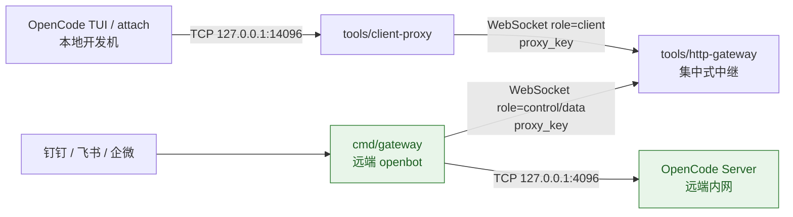

# Proxy Tunnel（HTTP 网关 + 客户端代理）

该方案用于在**不暴露远端 OpenCode `4096` 端口**的情况下，让本地 TUI 通过隧道访问远端 OpenCode。

## 组件

1. `tools/http-gateway`：公网可访问的 HTTP/WebSocket 中继网关
2. `cmd/gateway`：远端进程，启动时自动生成 `proxy_key`，并主动连接中继网关
3. `tools/client-proxy`：本地客户端代理，使用同一 `proxy_key` 建立隧道并暴露本地 TCP 端口

## 工作流程

1. 远端 `cmd/gateway` 启动后：
   - 自动生成一次性 `proxy_key`
   - 写入当前运行目录文件（默认 `.opencode-gateway-proxy.json`）
   - 主动以 WebSocket 连接 `PROXY_HUB_WS_URL`
2. 本地 `tools/client-proxy` 使用同一个 `proxy_key` 连接中继网关。
3. 中继网关按 `proxy_key` 将两条 WebSocket 连接配对并双向转发。
4. 远端 `cmd/gateway` 将 WebSocket 数据桥接到本机 OpenCode（默认 `127.0.0.1:4096`）。

> 当前实现中，`proxy_key` 为单次有效：客户端代理成功连接后即消费。

## 架构图



说明：
- OpenCode `4096` 仅在远端内网可见，不需要公网暴露。
- openbot 仅需出站连接到中继网关。
- 本地 TUI/attach 通过 `client-proxy` 与远端 OpenCode 建立临时通道。

## 运行

### 1) 启动 HTTP 网关（公网机器）

```bash
go run ./tools/http-gateway -addr :18080
```

### 2) 启动远端 gateway（与 OpenCode 同机）

设置环境变量：

- `PROXY_HUB_WS_URL`：例如 `ws://<公网IP或域名>:18080/ws`
- `PROXY_KEY_FILE`（可选）：默认 `.opencode-gateway-proxy.json`
- `PROXY_LOCAL_OPENCODE_ADDR`（可选）：默认 `127.0.0.1:4096`
- `PROXY_RECONNECT_DELAY`（可选）：默认 `5s`

然后启动：

```bash
go run ./cmd/gateway
```

启动后读取运行目录下的 `.opencode-gateway-proxy.json` 获取 `proxy_key`。

### 3) 启动本地客户端代理（开发机）

```bash
go run ./tools/client-proxy \
  -hub ws://<公网IP或域名>:18080/ws \
  -proxy-key <从远端文件读取的proxy_key> \
  -listen 127.0.0.1:14096
```

随后让本地 TUI 连接 `127.0.0.1:14096` 即可通过隧道访问远端 OpenCode。
